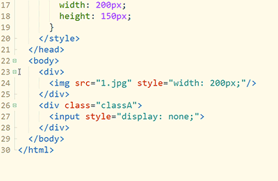

### 智能双击

在HBuilderX中，但凡特殊点的字符，都能智能双击。

- 双击引号/括号内侧，是选中引号/括号内的内容
- 双击逗号两侧，是选择逗号前一段或后一段
- 双击行尾，是选中该行(不含回车符)
- 双击连词符（-_）选中整个词
- 双击折叠行首内容开头，选择折叠段落
- 双击行首缩进，选择相同缩进的段落
- 双击列表符号，选择列表段落
- 双击Tag开头或结尾，选择整段Tag
- 双击属性赋值等号=，选择Html属性
- 双击if、function等关键字，选择整段包围区域
- 双击分号，选择js等语言的;分号前段落
- 双击css类名左侧，选择Css类
- 双击注释符选择注释区域
- 双击#选择markdown标题段落
- 双击语法定义符开头选择markdown图片、超链接、加粗、倾斜、代码等语法区
- [了解JSON智能双击](/Tutorial/Language/json?id=智能双击，快速选中数组或键值对)

下面是一个gif图例，双击选中tag和包围父tag

1. 双击div tag的首或尾可以选中这个tag，即开头的<左侧或结尾的>右侧。当然双击if、双击缩进符、双击括号引号内侧...很多位置都可以通过智能双击选中。具体见HBuilder的选择菜单。
2. 按Ctrl+]包围，就可以在这个选区首尾加父标签，同时闪烁光标。如果在js里，按下Ctrl+]不是包围tag，而是包围if、for等函数库，方便快速把一段代码放入if块中。
3. 输入div即可在首尾添加包围标签

	