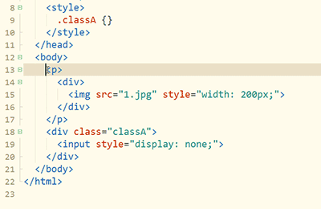

### 反包围

1. 双击tag p开头，选中该tag。
2. 按反包围`Ctrl+Shift+]`，可去掉tag p并自动处理子节点的缩进。

这里多提一句HBuilderX的快捷键理念，就是符号化，而不是字母化。很多工具的快捷键都是控制键+功能英文单词中的一个字母，这个是极难记忆的。

符号化让快捷键的记忆变简单，比如`Ctrl+]`是包围。

而反操作或增强操作一般是加Shift，比如Ctrl+Shift+]是反包围。