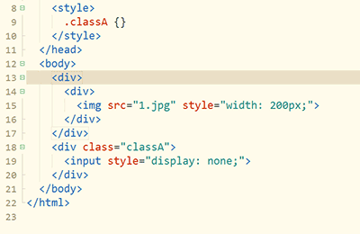

### 选中相同语法词及跳过某词

1. 下图中，使用普通的选择相同词Ctrl+e(mac是Cmd+d)，会把所有div都选中。但使用Ctrl+Shift+e（mac是Cmd+Shift+d），会智能识别语法，剔除不相干的词。
2. 下图按下选择相同语法词，同时选中tag首尾的div，而不会选中子节点的div。
3. 然后就可以方便的将原div改名为p

备注：
- 如果想选择配对括号，靠相同词是不行的。选中相同语法词会选中匹配的2个左右括号
- 批量选中所有相同词是Ctrl+Alt+e(mac是ctrl+alt+d)