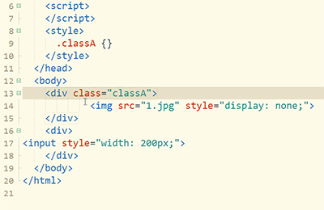

### 撤销最后一个多选区或多光标

选区选多了或选错了，不用担心要重头选，Ctrl+Shift+z不是撤销编辑内容，而是撤销最后一个选区。

1. 双击选中class
2. 按`Ctrl+e`选中相同词
3. 按`Ctrl+Shift+z`，不再选中最后一个词。

如果多选了一个词，还可以点`Ctrl+鼠标右键`取消一个选区。

跳过当前词选下一个词,`Alt+Shift+e`(mac是`ctrl+shift+d`)
