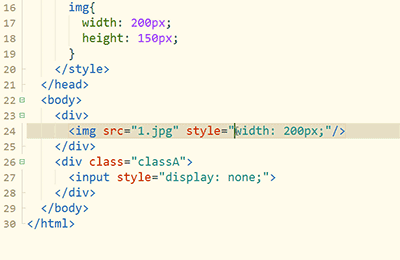
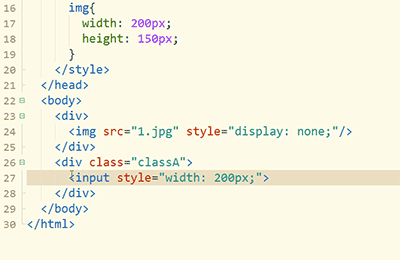

### 交换选区内容

当需要交互2个选区的内容时，选中a、剪切、点b前面、粘贴、选中b、找到之前a的位置点击、粘贴...这么长的操作太低效。

来看HBuilderX的`Ctrl+Shift+x`交互选区，也就是Ctrl+x的增强版。

1. 双击第1个style属性后的引号内侧，可选中引号内容。
2. 按下Ctrl后继续双击第2个style属性后的引号内侧，可选中2个引号内的选区。
3. 按下Ctrl+Shift+x，交换style属性的内容。

如果不选择内容，光标放置到2行，可直接交换这2行的内容，如下图

